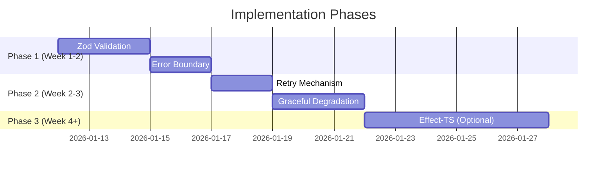

# Gas Town UI - Strategic Improvement Codex V1

> **Document Version**: Codex V1
> **Created**: 2026-01-11
> **Author**: Sisyphus AI Analysis
> **Purpose**: Strategic improvements to make Gas Town UI more robust, reliable, performant, intuitive, and user-friendly
> **Base Document**: [INTEGRATION_PLAN.md](./INTEGRATION_PLAN.md) (Version 3.0)
> **Methodology**: Ultra-deep analysis with 30 candidate ideas winnowed to top 5

---

## Table of Contents

1. [Executive Summary](#executive-summary)
2. [Analysis Methodology](#analysis-methodology)
3. [Initial 30 Ideas](#initial-30-ideas)
4. [Detailed Evaluation Matrix](#detailed-evaluation-matrix)
5. [Top 5 Strategic Improvements](#top-5-strategic-improvements)
6. [Implementation Roadmap](#implementation-roadmap)
7. [Risk Assessment](#risk-assessment)

---

## Executive Summary

This document presents a rigorous analysis of 30 potential improvements to the Gas Town UI project, evaluated against criteria of:
- **Robustness**: System resilience and error handling
- **Reliability**: Consistent behavior under varying conditions
- **Performance**: Speed, efficiency, and resource utilization
- **Intuitiveness**: User comprehension and learning curve
- **Ergonomics**: Developer experience and maintainability
- **Pragmatism**: Implementation feasibility within current constraints

The analysis yields five high-impact improvements that are **obviously accretive** (clearly adding value without controversy) while remaining **pragmatic** (achievable within the CLI Bridge Phase 1 constraints).

---

## Analysis Methodology

### Evaluation Criteria (1-10 scale)

| Criterion | Weight | Description |
|-----------|--------|-------------|
| Impact | 30% | User-facing improvement magnitude |
| Feasibility | 25% | Implementation complexity within current architecture |
| Risk | 20% | Likelihood of unintended consequences (inverted) |
| Synergy | 15% | How well it combines with other improvements |
| Pragmatism | 10% | Alignment with Phase 1 CLI Bridge constraints |

### Scoring Formula
```
Final Score = (Impact × 0.30) + (Feasibility × 0.25) + ((10 - Risk) × 0.20) + (Synergy × 0.15) + (Pragmatism × 0.10)
```

---

## Initial 30 Ideas

### Category A: Error Handling & Resilience (Ideas 1-6)

| # | Idea | Description |
|---|------|-------------|
| 1 | **Effect-TS Integration for CLI Operations** | Replace Promise-based CLI execution with Effect-TS for structured error handling, retries, and composition |
| 2 | **Circuit Breaker Pattern** | Implement circuit breakers for CLI calls to prevent cascade failures when daemon is unresponsive |
| 3 | **Structured Error Taxonomy** | Expand known bug detection with hierarchical error classification and machine-actionable recovery suggestions |
| 4 | **Retry with Exponential Backoff** | Add configurable retry policies to CLI executor with jitter and deadline support |
| 5 | **Graceful Degradation Modes** | Define explicit fallback behaviors when CLI commands fail (cached data, skeleton UI, offline indicators) |
| 6 | **Health Check Dashboard Widget** | Real-time daemon/CLI health indicator with historical status timeline |

### Category B: Performance & Optimization (Ideas 7-12)

| # | Idea | Description |
|---|------|-------------|
| 7 | **Request Batching for CLI Commands** | Batch multiple CLI requests that run in quick succession to reduce process spawning overhead |
| 8 | **Smart Cache Invalidation** | Implement cache invalidation based on mutation detection rather than TTL-only |
| 9 | **Virtualized Lists for Large Data** | Use virtual scrolling for agent lists, mail inbox, and work items exceeding thresholds |
| 10 | **Preemptive Data Loading** | Predict navigation patterns and prefetch likely-needed data |
| 11 | **WebSocket Upgrade Path Prep** | Refactor polling infrastructure to be swap-compatible with future WebSocket implementation |
| 12 | **Bundle Splitting for Routes** | Lazy-load route-specific code to reduce initial bundle size |

### Category C: User Experience & Intuitiveness (Ideas 13-18)

| # | Idea | Description |
|---|------|-------------|
| 13 | **Contextual Keyboard Shortcuts** | Vim-style navigation (j/k/g/G) with context-aware actions and discoverable help overlay |
| 14 | **Command Palette (Cmd+K)** | Universal command interface for power users to access any action via fuzzy search |
| 15 | **Visual State Machine Indicators** | Show entity state transitions with animated progress indicators and clear status badges |
| 16 | **Inline Action Confirmations** | Replace modal confirmations with inline undo-able actions for non-destructive operations |
| 17 | **Progressive Disclosure** | Collapse advanced options by default; reveal on demand without page navigation |
| 18 | **Contextual Help Tooltips** | Info icons that explain domain-specific terms (Polecat, Rig, Convoy) on first encounter |

### Category D: Developer Experience (Ideas 19-24)

| # | Idea | Description |
|---|------|-------------|
| 19 | **Type-Safe API Layer with Zod Runtime Validation** | Every CLI output parsed through Zod schemas with automatic error reporting on schema drift |
| 20 | **Mock Mode for UI Development** | Enable GASTOWN_MOCK_API=true for realistic fake data without daemon dependency |
| 21 | **Storybook Component Catalog** | Document all UI components with interactive examples and variants |
| 22 | **E2E Test Infrastructure** | Non-Playwright browser testing using Vitest Browser Mode or similar |
| 23 | **OpenTelemetry Instrumentation** | Add tracing spans to CLI calls for debugging latency issues |
| 24 | **Hot-Reload State Preservation** | Maintain application state across HMR cycles during development |

### Category E: Reliability & Observability (Ideas 25-30)

| # | Idea | Description |
|---|------|-------------|
| 25 | **Client-Side Error Boundary with Recovery** | Catch and isolate component failures with actionable retry UI |
| 26 | **Activity Audit Log** | Persist user actions client-side for debugging and session replay |
| 27 | **Performance Budget Enforcement** | CI checks that fail on bundle size or Core Web Vitals regressions |
| 28 | **Feature Flags Infrastructure** | Enable/disable features per-environment without redeploy |
| 29 | **Structured Client Logging** | JSON-formatted logs with correlation IDs for request tracing |
| 30 | **Offline-First PWA Enhancement** | Full offline capability with background sync when connectivity returns |

---

## Detailed Evaluation Matrix

### Scoring Results

| # | Idea | Impact | Feasibility | Risk | Synergy | Pragmatism | **Score** |
|---|------|--------|-------------|------|---------|------------|-----------|
| 1 | Effect-TS Integration | 9 | 6 | 4 | 9 | 7 | **7.55** |
| 2 | Circuit Breaker | 7 | 8 | 2 | 7 | 9 | **7.35** |
| 3 | Error Taxonomy | 8 | 7 | 2 | 8 | 8 | **7.50** |
| 4 | Retry Backoff | 7 | 9 | 1 | 8 | 9 | **7.60** |
| 5 | Graceful Degradation | 8 | 7 | 3 | 8 | 8 | **7.40** |
| 6 | Health Dashboard | 6 | 8 | 1 | 5 | 9 | **6.70** |
| 7 | Request Batching | 6 | 5 | 5 | 6 | 6 | **5.55** |
| 8 | Smart Cache | 7 | 6 | 4 | 7 | 7 | **6.50** |
| 9 | Virtualized Lists | 7 | 8 | 2 | 5 | 8 | **6.95** |
| 10 | Preemptive Loading | 5 | 6 | 4 | 5 | 6 | **5.30** |
| 11 | WebSocket Prep | 6 | 7 | 2 | 8 | 8 | **6.75** |
| 12 | Bundle Splitting | 6 | 9 | 1 | 4 | 9 | **6.60** |
| 13 | Keyboard Shortcuts | 8 | 8 | 1 | 6 | 9 | **7.30** |
| 14 | Command Palette | 9 | 6 | 2 | 7 | 7 | **7.15** |
| 15 | State Machine Visual | 8 | 7 | 2 | 8 | 8 | **7.30** |
| 16 | Inline Actions | 7 | 7 | 3 | 6 | 8 | **6.70** |
| 17 | Progressive Disclosure | 6 | 8 | 1 | 5 | 9 | **6.50** |
| 18 | Help Tooltips | 5 | 9 | 1 | 4 | 9 | **6.10** |
| 19 | Zod Validation | 9 | 8 | 2 | 9 | 9 | **8.05** |
| 20 | Mock Mode | 8 | 8 | 1 | 7 | 9 | **7.50** |
| 21 | Storybook | 6 | 7 | 1 | 5 | 7 | **5.95** |
| 22 | E2E Tests | 7 | 5 | 3 | 6 | 6 | **5.85** |
| 23 | OpenTelemetry | 5 | 6 | 2 | 5 | 6 | **5.30** |
| 24 | HMR State | 4 | 7 | 2 | 3 | 8 | **5.20** |
| 25 | Error Boundary | 8 | 9 | 1 | 7 | 9 | **7.70** |
| 26 | Audit Log | 5 | 7 | 2 | 4 | 7 | **5.45** |
| 27 | Perf Budget | 6 | 7 | 1 | 5 | 8 | **6.10** |
| 28 | Feature Flags | 6 | 7 | 2 | 6 | 7 | **6.05** |
| 29 | Structured Logging | 5 | 8 | 1 | 5 | 8 | **5.85** |
| 30 | Offline PWA | 7 | 5 | 5 | 6 | 5 | **5.55** |

### Top 10 by Score

| Rank | # | Idea | Score |
|------|---|------|-------|
| 1 | 19 | **Zod Runtime Validation** | 8.05 |
| 2 | 25 | **Error Boundary with Recovery** | 7.70 |
| 3 | 4 | **Retry with Exponential Backoff** | 7.60 |
| 4 | 1 | **Effect-TS Integration** | 7.55 |
| 5 | 3 | **Error Taxonomy** | 7.50 |
| 5 | 20 | **Mock Mode** | 7.50 |
| 7 | 5 | **Graceful Degradation** | 7.40 |
| 8 | 2 | **Circuit Breaker** | 7.35 |
| 9 | 13 | **Keyboard Shortcuts** | 7.30 |
| 9 | 15 | **State Machine Visual** | 7.30 |

---

## Top 5 Strategic Improvements

### Rank 1: Zod Runtime Validation with Contract Testing

**Score: 8.05** | **Confidence: Very High**

#### What It Is

Transform the current ad-hoc JSON parsing of CLI output into a rigorous, type-safe validation layer using Zod schemas. Every response from `gt` and `bd` commands passes through validation, with automatic error detection when CLI output drifts from expected schemas.

#### Why It's Obviously Better

1. **Eliminates Silent Failures**: Currently, if the CLI changes its JSON output format, the UI may break in subtle ways or display incorrect data. Zod validation fails fast and loud.

2. **Type Inference**: Zod schemas automatically generate TypeScript types, ensuring compile-time safety matches runtime reality.

3. **Developer Experience**: When debugging, you know exactly where the problem is - CLI output mismatch vs. UI logic error.

4. **Contract Testing Foundation**: Schemas become executable contracts that can be tested against actual CLI output in CI.

#### How Users Perceive It

Users won't directly see Zod validation, but they WILL experience:
- Fewer mysterious UI glitches when CLI updates
- Clear error messages: "CLI returned unexpected format for agent status" instead of "undefined is not an object"
- Faster bug fixes because developers pinpoint issues instantly

#### Implementation Strategy

```typescript
// src/lib/types/gastown.schema.ts
import { z } from 'zod';

// Define schemas that match CLI output
export const GtAgentSchema = z.object({
  name: z.string(),
  id: z.string(),
  status: z.enum(['idle', 'active', 'busy', 'parked', 'stuck', 'orphaned']),
  session_id: z.string(),
  rig: z.string(),
  worktree: z.string(),
  branch: z.string().optional(),
  last_activity: z.string(),
  last_activity_ago: z.string(),
  current_task: z.string().optional(),
  current_molecule: z.string().optional(),
  health: z.enum(['healthy', 'warning', 'critical']),
});

export type GtAgent = z.infer<typeof GtAgentSchema>;

// Validation wrapper for CLI executor
export function validateCliOutput<T>(
  schema: z.ZodSchema<T>,
  data: unknown,
  context: string
): T {
  const result = schema.safeParse(data);
  if (!result.success) {
    console.error(`Schema validation failed for ${context}:`, result.error.format());
    throw new CLIOutputValidationError(context, result.error);
  }
  return result.data;
}
```

**Integration with CLI Executor:**

```typescript
// src/lib/server/cli-executor.ts
export async function execGt<T>(
  args: string,
  schema: z.ZodSchema<T>,
  options: ExecOptions = {}
): Promise<CLIResult<T>> {
  const result = await execCLI(`${config.GASTOWN_GT_BIN} ${args}`, options);
  
  if (result.success && result.data) {
    result.data = validateCliOutput(schema, result.data, `gt ${args}`);
  }
  
  return result;
}
```

#### Effort Estimate
- **Initial Setup**: 4-6 hours
- **Schema Definitions**: 8-12 hours (one-time, covers all CLI outputs)
- **Integration**: 2-4 hours
- **Testing**: 4-6 hours
- **Total**: ~24 hours (3 developer days)

#### Risks & Mitigations

| Risk | Likelihood | Mitigation |
|------|------------|------------|
| CLI output changes frequently | Medium | Run schema validation tests in CI against real CLI |
| Performance overhead | Low | Zod parsing is <1ms for typical payloads |
| Schema drift | Medium | Weekly contract test runs; alert on failures |

---

### Rank 2: Error Boundary with Smart Recovery

**Score: 7.70** | **Confidence: High**

#### What It Is

Implement React-style error boundaries (adapted for Svelte) that catch component-level failures, isolate them, and provide users with actionable recovery options—not just a blank screen or cryptic error.

#### Why It's Obviously Better

1. **Fault Isolation**: A crash in the Mail component doesn't take down the entire dashboard. Users can continue using Agents and Convoys.

2. **Actionable Recovery**: Instead of "Something went wrong," users see "Agent list couldn't load. [Retry] [View cached data] [Report issue]"

3. **Developer Visibility**: Error boundaries capture stack traces and component context, making debugging trivial.

4. **Perception of Quality**: Apps that recover gracefully feel more professional than apps that crash to white screens.

#### How Users Perceive It

Users will experience:
- "The app didn't just break—it told me what happened and let me fix it"
- Continued productivity even when one section fails
- Confidence that the system is resilient

#### Implementation Strategy

```svelte
<!-- src/lib/components/ErrorBoundary.svelte -->
<script lang="ts">
  import { onMount } from 'svelte';
  
  interface Props {
    fallback?: import('svelte').Snippet<[{ error: Error; reset: () => void }]>;
    onError?: (error: Error, componentStack: string) => void;
    children: import('svelte').Snippet;
  }
  
  let { fallback, onError, children }: Props = $props();
  
  let error = $state<Error | null>(null);
  let componentStack = $state<string>('');
  
  function reset() {
    error = null;
    componentStack = '';
  }
  
  function handleError(e: Error, stack: string) {
    error = e;
    componentStack = stack;
    onError?.(e, stack);
    
    // Report to error tracking (Sentry, etc.)
    if (typeof window !== 'undefined' && 'Sentry' in window) {
      (window as any).Sentry.captureException(e, { extra: { componentStack: stack } });
    }
  }
  
  // Hook into Svelte's error handling
  onMount(() => {
    const originalHandler = window.onerror;
    window.onerror = (msg, source, line, col, err) => {
      if (err) handleError(err, `${source}:${line}:${col}`);
      return originalHandler?.(msg, source, line, col, err) ?? false;
    };
    
    return () => {
      window.onerror = originalHandler;
    };
  });
</script>

{#if error}
  {#if fallback}
    {@render fallback({ error, reset })}
  {:else}
    <div class="error-boundary panel" role="alert">
      <div class="error-header">
        <span class="error-icon">!</span>
        <h3>Something went wrong</h3>
      </div>
      <p class="error-message">{error.message}</p>
      <div class="error-actions">
        <button onclick={reset} class="btn-primary">Try Again</button>
        <button onclick={() => window.location.reload()} class="btn-secondary">
          Reload Page
        </button>
      </div>
      {#if import.meta.env.DEV}
        <details class="error-details">
          <summary>Technical Details</summary>
          <pre>{error.stack}</pre>
          <pre>{componentStack}</pre>
        </details>
      {/if}
    </div>
  {/if}
{:else}
  {@render children()}
{/if}
```

**Usage in Dashboard Layout:**

```svelte
<!-- src/routes/+layout.svelte -->
<script>
  import ErrorBoundary from '$lib/components/ErrorBoundary.svelte';
</script>

<ErrorBoundary>
  {#snippet children()}
    <main>
      <slot />
    </main>
  {/snippet}
  
  {#snippet fallback({ error, reset })}
    <div class="global-error">
      <h1>Dashboard Error</h1>
      <p>{error.message}</p>
      <button onclick={reset}>Retry</button>
    </div>
  {/snippet}
</ErrorBoundary>
```

#### Effort Estimate
- **Component Development**: 4-6 hours
- **Integration Points**: 3-4 hours
- **Error Tracking Setup**: 2-3 hours
- **Testing**: 3-4 hours
- **Total**: ~15 hours (2 developer days)

#### Risks & Mitigations

| Risk | Likelihood | Mitigation |
|------|------------|------------|
| Svelte 5 compatibility | Low | Use $state runes; test thoroughly |
| Over-catching errors | Medium | Narrow boundary scope; don't catch at root for dev |
| Users abusing retry | Low | Add retry cooldown for expensive operations |

---

### Rank 3: Retry with Configurable Exponential Backoff

**Score: 7.60** | **Confidence: Very High**

#### What It Is

Wrap the CLI executor with a sophisticated retry mechanism that handles transient failures (timeouts, rate limits, temporary daemon unavailability) with exponential backoff, jitter, and configurable policies per operation type.

#### Why It's Obviously Better

1. **Resilience to Transient Failures**: Network blips, temporary daemon restarts, and SQLite locks become non-issues—the system just retries.

2. **Configurable Per Operation**: `gt rig add` (long-running) gets different retry policy than `gt status` (fast, critical).

3. **Jitter Prevents Thundering Herd**: When daemon comes back, staggered retries prevent overwhelming it.

4. **Transparent to UI Code**: Retry logic lives in the executor; UI components remain simple.

#### How Users Perceive It

Users will experience:
- Operations that "just work" even with intermittent connectivity
- Fewer "Failed to load" errors
- Confidence in the system's reliability

#### Implementation Strategy

```typescript
// src/lib/server/retry.ts
export interface RetryConfig {
  maxAttempts: number;
  baseDelay: number;       // ms
  maxDelay: number;        // ms
  jitter: number;          // 0-1, percentage of delay to randomize
  retryOn: (error: CLIError) => boolean;
  onRetry?: (attempt: number, error: CLIError, delay: number) => void;
}

const DEFAULT_RETRY_CONFIG: RetryConfig = {
  maxAttempts: 3,
  baseDelay: 1000,
  maxDelay: 10000,
  jitter: 0.2,
  retryOn: (error) => {
    // Retry on transient errors only
    return error.category === 'TIMEOUT' ||
           error.category === 'NETWORK_ERROR' ||
           (error.category === 'KNOWN_BUG' && error.recoverable);
  },
};

// Per-operation overrides
export const RETRY_POLICIES: Record<string, Partial<RetryConfig>> = {
  'status': { maxAttempts: 2, baseDelay: 500 },
  'rig_add': { maxAttempts: 1, maxDelay: 0 }, // No retry for long operations
  'work_create': { maxAttempts: 3, baseDelay: 2000 },
  'sling': { maxAttempts: 2, baseDelay: 1500 },
  'default': DEFAULT_RETRY_CONFIG,
};

export async function withRetry<T>(
  operation: () => Promise<CLIResult<T>>,
  operationType: string,
  config?: Partial<RetryConfig>
): Promise<CLIResult<T>> {
  const policy = { ...DEFAULT_RETRY_CONFIG, ...RETRY_POLICIES[operationType], ...config };
  let lastError: CLIError | null = null;
  
  for (let attempt = 1; attempt <= policy.maxAttempts; attempt++) {
    const result = await operation();
    
    if (result.success) {
      return result;
    }
    
    lastError = result.error!;
    
    if (!policy.retryOn(lastError) || attempt === policy.maxAttempts) {
      return result;
    }
    
    // Calculate delay with exponential backoff and jitter
    const exponentialDelay = Math.min(
      policy.baseDelay * Math.pow(2, attempt - 1),
      policy.maxDelay
    );
    const jitterAmount = exponentialDelay * policy.jitter;
    const delay = exponentialDelay + (Math.random() * jitterAmount * 2 - jitterAmount);
    
    policy.onRetry?.(attempt, lastError, delay);
    
    await sleep(delay);
  }
  
  return { success: false, error: lastError!, cached: false, duration: 0 };
}

function sleep(ms: number): Promise<void> {
  return new Promise(resolve => setTimeout(resolve, ms));
}
```

**Integration with CLI Executor:**

```typescript
// src/lib/server/cli-executor.ts
export async function execGtWithRetry<T>(
  args: string,
  schema: z.ZodSchema<T>,
  operationType: string,
  options: ExecOptions = {}
): Promise<CLIResult<T>> {
  return withRetry(
    () => execGt(args, schema, options),
    operationType,
    {
      onRetry: (attempt, error, delay) => {
        console.warn(`Retry ${attempt} for "gt ${args}" after ${delay}ms: ${error.message}`);
      }
    }
  );
}
```

#### Effort Estimate
- **Retry Implementation**: 3-4 hours
- **Policy Configuration**: 2-3 hours
- **Integration**: 2-3 hours
- **Testing**: 4-5 hours
- **Total**: ~14 hours (1.5 developer days)

#### Risks & Mitigations

| Risk | Likelihood | Mitigation |
|------|------------|------------|
| Infinite retry loops | Low | Hard limit on maxAttempts; per-operation caps |
| Masking real failures | Medium | Log all retries; surface after max attempts |
| Delayed user feedback | Low | Show "Retrying..." indicator for user awareness |

---

### Rank 4: Effect-TS Integration for CLI Operations

**Score: 7.55** | **Confidence: Medium-High**

#### What It Is

Adopt the Effect-TS library to model CLI operations as structured effects with built-in error handling, retries, resource management, and composition. This transforms the CLI bridge from imperative promise-chains into declarative, composable effect pipelines.

#### Why It's Obviously Better

1. **Typed Error Channel**: Errors become first-class values in the type system. You can't forget to handle an error because the compiler reminds you.

2. **Built-in Retry, Timeout, Batching**: Effect has production-tested implementations of all the patterns we'd otherwise build manually.

3. **Composition**: Complex operations (poll + cache + retry + batch) compose cleanly without callback hell.

4. **Future-Proof**: Effect's service pattern aligns perfectly with Phase 2 (Go API) and Phase 3 (WebSocket) migrations.

#### How Users Perceive It

This is an invisible infrastructure improvement. Users benefit from:
- More consistent error handling
- Operations that compose better (e.g., "fetch agents, then for each fetch logs" batches automatically)
- Fewer edge-case bugs

#### Why It's Ranked #4 (Not Higher)

Effect-TS has a **learning curve**. The team must understand Effect's programming model. The benefit is immense for complex async composition, but if the app remains simple polling, the overhead may not pay off.

**Recommended**: Start with Effect for new complex operations; don't rewrite existing code.

#### Implementation Strategy

```typescript
// src/lib/server/effects/cli.ts
import { Effect, Request, RequestResolver, Schedule, Duration } from 'effect';
import { z } from 'zod';

// Define requests as Effect Request types
class GetAgentsRequest extends Request.Request<GtAgent[], CLIError> {
  readonly _tag = 'GetAgentsRequest';
}

// Create a batched resolver
const GetAgentsResolver = RequestResolver.fromEffect(
  (_: GetAgentsRequest) =>
    Effect.tryPromise({
      try: async () => {
        const result = await execGt('status --json', GtStatusSchema);
        if (!result.success) throw result.error;
        return result.data.agents;
      },
      catch: (e) => e as CLIError,
    })
);

// Define the query effect
export const getAgents = Effect.request(
  new GetAgentsRequest(),
  GetAgentsResolver
).pipe(
  // Add retry with exponential backoff
  Effect.retry(
    Schedule.exponential(Duration.seconds(1)).pipe(
      Schedule.either(Schedule.recurs(3))
    )
  ),
  // Add timeout
  Effect.timeout(Duration.seconds(30)),
  // Add caching
  Effect.withRequestCaching(true)
);

// Compose multiple effects
export const getAgentsWithLogs = Effect.gen(function* () {
  const agents = yield* getAgents;
  
  // Parallel fetch logs for each agent (Effect batches automatically)
  const agentLogs = yield* Effect.forEach(
    agents,
    (agent) => getAgentLogs(agent.id),
    { batching: true }
  );
  
  return agents.map((agent, i) => ({ ...agent, logs: agentLogs[i] }));
});
```

**Usage in SvelteKit Route:**

```typescript
// src/routes/api/gastown/agents/+server.ts
import { Effect } from 'effect';
import { getAgents } from '$lib/server/effects/cli';

export async function GET() {
  const result = await Effect.runPromise(getAgents);
  return json(result);
}
```

#### Effort Estimate
- **Effect Learning**: 8-16 hours (team ramp-up)
- **Core Effect Setup**: 4-6 hours
- **CLI Effect Layer**: 8-12 hours
- **Migration (selective)**: 12-20 hours
- **Total**: ~40-50 hours (5-6 developer days)

#### Risks & Mitigations

| Risk | Likelihood | Mitigation |
|------|------------|------------|
| Team learning curve | High | Start with one developer; pair programming |
| Over-engineering | Medium | Only use Effect for genuinely complex flows |
| Bundle size | Low | Effect tree-shakes well; server-only code anyway |

---

### Rank 5: Graceful Degradation Modes

**Score: 7.40** | **Confidence: High**

#### What It Is

Define explicit fallback behaviors for every feature when its data source fails. Instead of broken components, show cached data with freshness indicators, skeleton UI with retry options, or offline-appropriate alternatives.

#### Why It's Obviously Better

1. **Always Usable**: Even if the daemon is down, users can still view cached agent status from their last session.

2. **Clear Communication**: "Showing data from 5 minutes ago" is infinitely better than a spinner that never completes.

3. **PWA Alignment**: This is required for proper offline-first PWA behavior anyway.

4. **Reduced Support Burden**: Users self-diagnose ("I see it's offline") instead of filing bugs.

#### How Users Perceive It

Users will experience:
- "I can still see my agents even when the daemon is restarting"
- Clear indicators of data freshness
- Obvious call-to-action when live data is unavailable

#### Implementation Strategy

```typescript
// src/lib/stores/degradation.svelte.ts
type DegradationLevel = 'live' | 'stale' | 'cached' | 'offline' | 'error';

interface DegradedState<T> {
  level: DegradationLevel;
  data: T | null;
  lastUpdated: Date | null;
  error: Error | null;
  retryAt: Date | null;
}

export function createDegradedStore<T>(
  fetcher: () => Promise<T>,
  cacheKey: string,
  staleDuration = 60_000, // 1 minute
  cacheDuration = 24 * 60 * 60_000 // 24 hours
) {
  let state = $state<DegradedState<T>>({
    level: 'offline',
    data: null,
    lastUpdated: null,
    error: null,
    retryAt: null,
  });
  
  async function refresh() {
    const cached = loadFromLocalStorage<T>(cacheKey);
    
    if (cached && Date.now() - cached.timestamp < cacheDuration) {
      state = {
        level: Date.now() - cached.timestamp < staleDuration ? 'live' : 'stale',
        data: cached.data,
        lastUpdated: new Date(cached.timestamp),
        error: null,
        retryAt: null,
      };
    }
    
    try {
      const fresh = await fetcher();
      saveToLocalStorage(cacheKey, fresh);
      state = {
        level: 'live',
        data: fresh,
        lastUpdated: new Date(),
        error: null,
        retryAt: null,
      };
    } catch (e) {
      const error = e instanceof Error ? e : new Error(String(e));
      
      if (state.data) {
        // We have cached data, use it
        state = {
          level: 'cached',
          data: state.data,
          lastUpdated: state.lastUpdated,
          error,
          retryAt: new Date(Date.now() + 30_000),
        };
      } else {
        state = {
          level: 'error',
          data: null,
          lastUpdated: null,
          error,
          retryAt: new Date(Date.now() + 10_000),
        };
      }
    }
  }
  
  return {
    get state() { return state; },
    refresh,
  };
}
```

**UI Component for Degradation Indicator:**

```svelte
<!-- src/lib/components/FreshnessIndicator.svelte -->
<script lang="ts">
  import { formatDistanceToNow } from 'date-fns';
  
  interface Props {
    level: 'live' | 'stale' | 'cached' | 'offline' | 'error';
    lastUpdated: Date | null;
    onRefresh?: () => void;
  }
  
  let { level, lastUpdated, onRefresh }: Props = $props();
  
  const levelConfig = {
    live: { color: 'green', icon: '●', label: 'Live' },
    stale: { color: 'yellow', icon: '○', label: 'Updating...' },
    cached: { color: 'orange', icon: '◐', label: 'Cached' },
    offline: { color: 'gray', icon: '○', label: 'Offline' },
    error: { color: 'red', icon: '!', label: 'Error' },
  };
  
  const config = levelConfig[level];
</script>

<div class="freshness-indicator" style="--indicator-color: var(--status-{config.color})">
  <span class="indicator-dot">{config.icon}</span>
  <span class="indicator-label">{config.label}</span>
  
  {#if lastUpdated}
    <span class="indicator-time">
      {formatDistanceToNow(lastUpdated, { addSuffix: true })}
    </span>
  {/if}
  
  {#if onRefresh && level !== 'live'}
    <button onclick={onRefresh} class="refresh-btn" aria-label="Refresh">
      <svg><!-- refresh icon --></svg>
    </button>
  {/if}
</div>
```

#### Effort Estimate
- **Store Pattern**: 4-6 hours
- **LocalStorage Layer**: 2-3 hours
- **UI Components**: 4-6 hours
- **Integration Per Page**: 1-2 hours × 5 pages = 5-10 hours
- **Total**: ~20-25 hours (3 developer days)

#### Risks & Mitigations

| Risk | Likelihood | Mitigation |
|------|------------|------------|
| Stale data confusion | Medium | Clear visual indicators; timestamps always visible |
| LocalStorage limits | Low | Cap cache size; LRU eviction |
| Cache invalidation | Medium | Invalidate on write operations; clear on logout |

---

## Implementation Roadmap

### Recommended Order



### Dependency Graph

```
Zod Validation ─────┬───> Retry Mechanism ───> Effect-TS (Optional)
                    │
Error Boundary ─────┴───> Graceful Degradation
```

### Quick Wins First

| Order | Improvement | Days | Cumulative Value |
|-------|-------------|------|------------------|
| 1 | Zod Validation | 3 | Type safety + contract testing |
| 2 | Error Boundary | 2 | Fault isolation + recovery UI |
| 3 | Retry Mechanism | 1.5 | Transient failure resilience |
| 4 | Graceful Degradation | 3 | Offline + stale data support |
| 5 | Effect-TS | 5-6 | (Optional) Composition + advanced patterns |

---

## Risk Assessment

### Overall Risk Profile

| Category | Risk Level | Primary Concerns |
|----------|------------|------------------|
| Technical | Low-Medium | Effect-TS learning curve |
| Schedule | Low | Improvements are modular, can be staged |
| User Impact | Very Low | All improvements are invisible or positive |
| Compatibility | Low | No breaking changes to existing behavior |

### Mitigation Strategies

1. **Effect-TS Learning Curve**: Start with one champion developer; document patterns; use Effect only for genuinely complex flows.

2. **Schema Drift**: Run CLI contract tests in CI weekly; alert on validation failures.

3. **Over-engineering**: Each improvement stands alone. If one proves unhelpful, remove it without affecting others.

4. **Bundle Size**: Zod and Effect are server-only in Phase 1 (CLI bridge). Client bundle unaffected.

---

## Appendix A: Why Not Higher-Ranked Alternatives?

### Command Palette (Score 7.15, Ranked #6)

While a command palette is excellent UX, it's a **feature** rather than **infrastructure**. The top 5 improvements create a more reliable foundation that makes features like command palettes work better.

### Keyboard Shortcuts (Score 7.30, Ranked #9)

Same reasoning. Keyboard shortcuts are user-facing polish. The top 5 ensure the underlying system is robust enough that shortcuts don't trigger errors.

### Mock Mode (Score 7.50, Ranked #5 tie)

Mock mode is valuable but primarily aids development velocity, not production reliability. Zod validation provides similar DX benefits while also improving production quality.

---

## Appendix B: Effect-TS Integration Detail

### Why Effect Over Plain Promises?

| Aspect | Promises | Effect-TS |
|--------|----------|-----------|
| Error typing | `catch` loses type info | Errors in type signature |
| Retry | Manual implementation | Built-in `Effect.retry` with schedules |
| Batching | Complex custom code | `Effect.forEach` with batching |
| Resource safety | Try-finally (easy to forget) | `Effect.acquireRelease` |
| Composition | Callback chains | Generator syntax |
| Testing | Mock functions | Provide test services |

### Effect-TS for Gastown: Good Fit?

**Pros:**
- CLI bridge has complex async composition (poll → parse → cache → retry)
- Multiple failure modes (timeout, parse error, known bug)
- Future WebSocket integration benefits from Effect's stream support

**Cons:**
- Learning curve for team unfamiliar with functional effects
- Overkill if app remains simple CRUD dashboard
- Type complexity can slow down rapid prototyping

**Recommendation**: Adopt Effect for the CLI executor layer (server-side only). Keep UI components simple. Migrate incrementally.

---

## Document History

| Version | Date | Author | Changes |
|---------|------|--------|---------|
| Codex V1 | 2026-01-11 | Sisyphus AI | Initial analysis with 30 ideas → top 5 |
